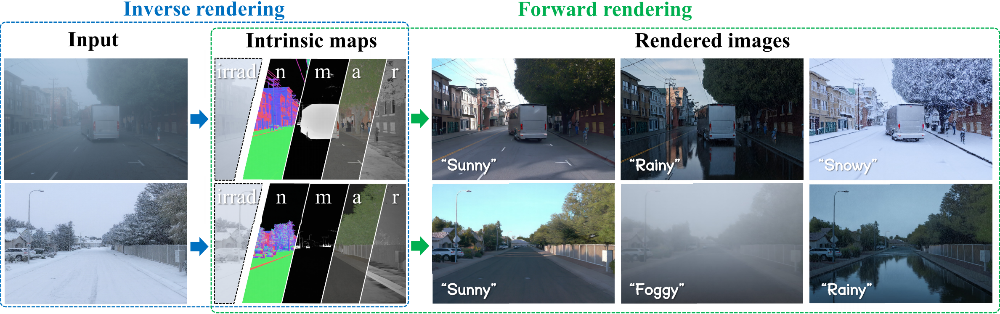

# IntrinsicWeather: Controllable Weather Editing in Intrinsic Space
<div align="center">
  
</div>


[Yixin Zhu](https://yixinzhu042.github.io/), [Zuo-Liang Zhu](https://github.com/NK-CS-ZZL), [Jian Yang](https://www.patternrecognition.asia/jian/), [Miloš Hašan](https://miloshasan.net/), [Jin Xie](https://csjinxie.github.io/), [Beibei Wang](https://wangningbei.github.io/)

---


## TODO

- [✅] Release WeatherSynthetic dataset 
- [ ] Release WeatherReal construction pipeline
- [ ] Release pretrained checkpoints
- [ ] Add Gradio / WebUI for inference
- [ ] Release training code


---

## Dataset

### WeatherSynthetic
Our synthetic dataset is available in 🤗HuggingFace [GilgameshYX/WeatherSynthetic](https://huggingface.co/datasets/GilgameshYX/WeatherSynthetic)

You can download easily using huggingface-cli:
```bash
hf download --repo-type dataset stepfun-ai/Step-3.5-Flash-SFT --local-dir WeatherSynthetic
```
The dataset format is supposed as follows:
```
weatherSynthetic/
├── scene.txt                   # Scene list
├── Driving_prompts.json        # Text prompts
├── Modern_city/
│   ├── image/{weather}/        # {id}_image.exr, {id}_irradiance.exr
│   └── property/               # albedo, normal, roughness, metallic
├── Small_city/
└── ...
```

**Weather types:** `sunny`, `rainy`, `foggy`, `snowy`, `overcast`, `night`, `early_morning`, `rain_storm`, `sand_storm`, etc.

We provide an example script to load, process, and visualize RGB image and intrinsic maps.
```bash
python -m data.WeatherSynthetic
```
